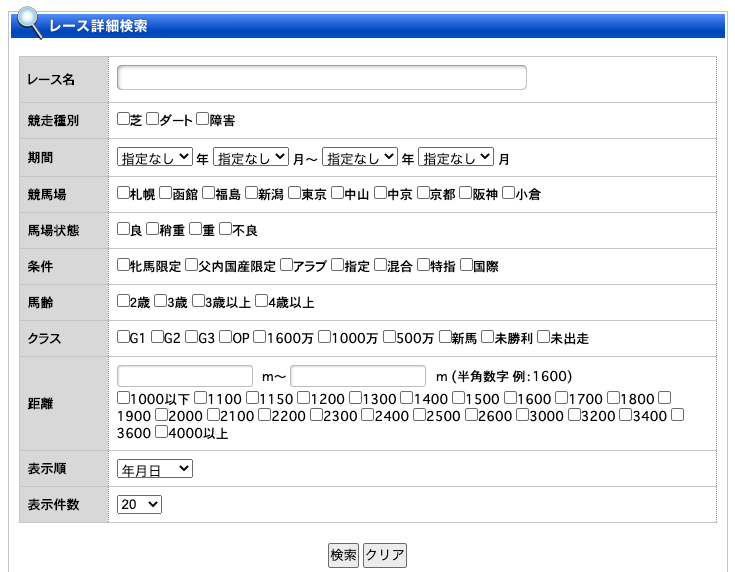

# karby
競馬用スクレイピング

収集先

> https://www.netkeiba.com/


ネット競馬は特殊なのでSeleniumが必要

localやとdriverとかめんどくさいのでDocker使い。ますた

`config.yaml` で収集対象を `True` に置き換えてください




## 実行方法

- レースのエンドポイントが欲しい人

```
$ docker built -t unko .
$ docker run --rm -v "$PWD:/work" unko python endpoints.py
```

`out.txt` にレースのエンドポイントが保存されます

- レース結果が欲しい人とか

`jupyter_example.ipynb` をみてくださいい
